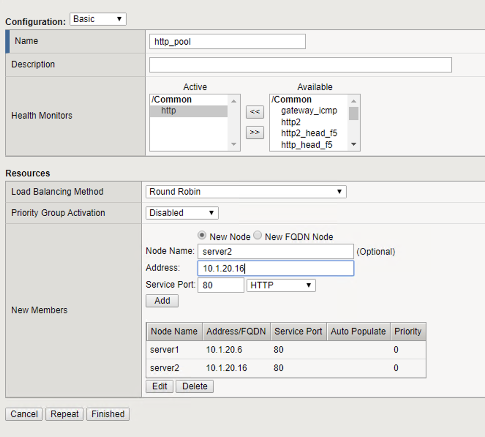
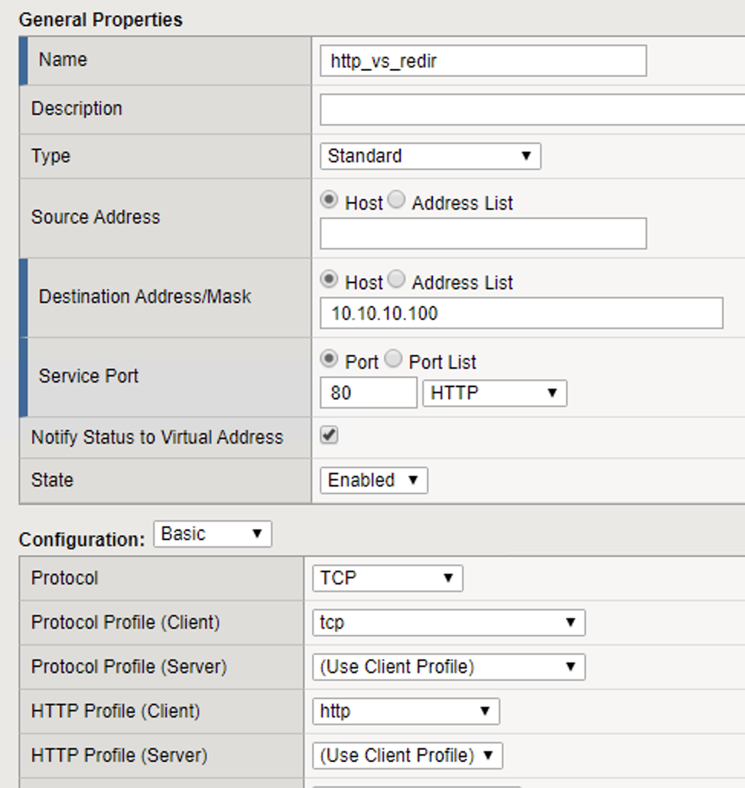
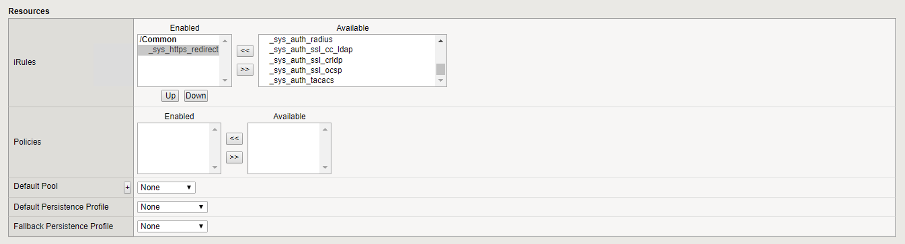
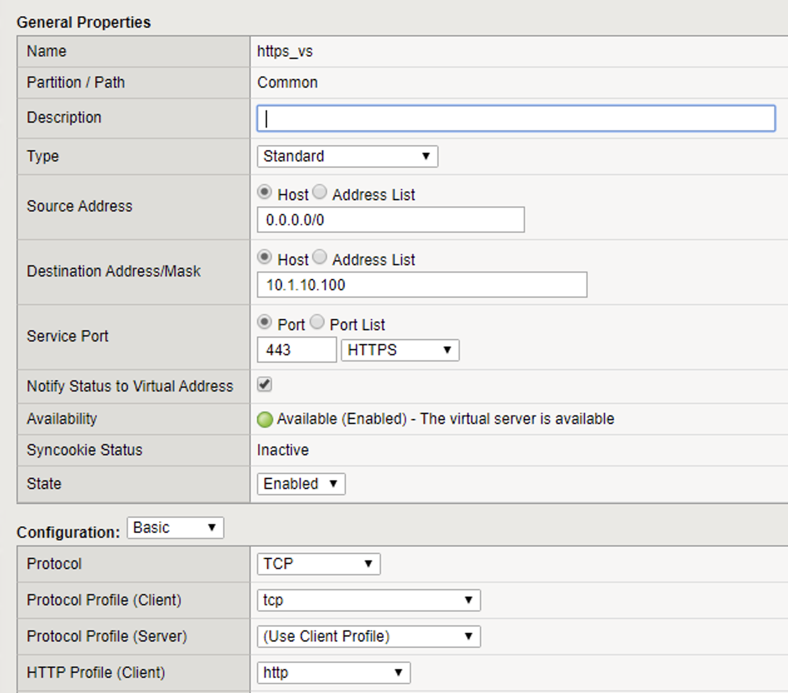
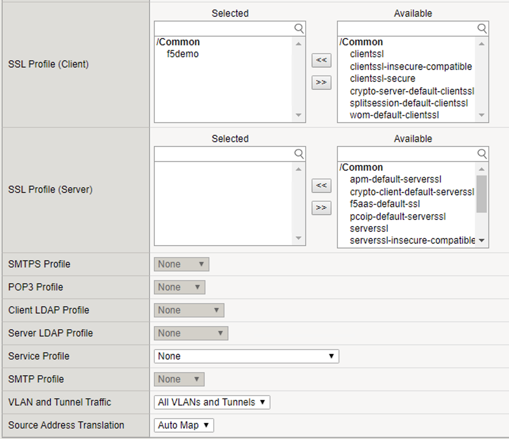
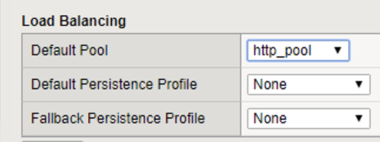
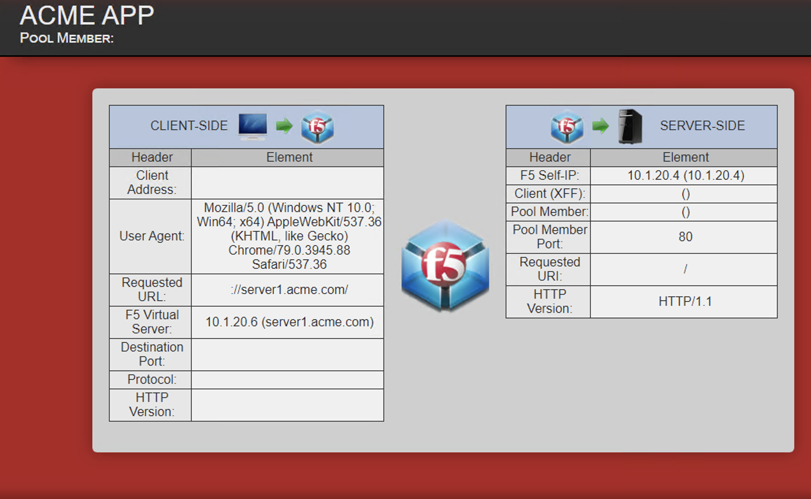

Lab 1: System Setup
======================================

The purpose of this lab is to configure a basic vip on which subsequent labs will be built. 

Objective:
----------

In this lab, we will configure resources including Virtual Servers, Pools, and monitors that we will use as the foundation for subsequent labs.

Lab Requirements:
-----------------

-  All Lab requirements will be noted in the tasks that follow

-  Estimated completion time: 10 minutes

Lab 1 Tasks:
-----------------

TASK 1: Create A Pool
~~~~~~~~~~~~~~~~~~~~~~~~~~~~~~~~~~~~~~~~~~~~~~~~

1.	Browse to Local Traffic > Pools and click the ‘+’ next to Pools List to create a new pool.  
2.	Name the pool in “http_pool”
3.	Assign the monitor “http” by selecting it and sliding it to the left.
4.	Add the following “new node” members to the pool: 

•	Address: 10.1.20.6 Service Port 80

•	Address: 10.1.20.16 Service Port 80

|image001|

5. Click **Finished**

Task 2: Create HTTP Virtual Server to redirect to HTTPS
~~~~~~~~~~~~~~~~~~~~~~~~~~~~~~~~~~~~~~~~~~~~~~~~~~~~~~~~

1.	Create a new Virtual Server by browsing to Local Traffic > Virtual Servers > Virtual Server List and click the ‘+’ to create a new one.

2.	Name the Virtual Server in the following format http_vs_redir.  For “Destination Address/Mask”, use 10.1.10.100". For “Service Port”, use 80.

3.	For “HTTP Profile” choose the default http profile called http

4.	Under iRules at the bottom of the screen, select the sys_https_redirect irule from the “Available” list and slide it over to the “Enabled” list and click Finished.

|image002|

|image003|

5. Click **Finished**

Task 3: Create HTTPS Virtual Server
~~~~~~~~~~~~~~~~~~~~~~~~~~~~~~~~~~~~~~~~~~~~~~~~~~~~~~~~

1.	Create a new Virtual Server by browsing to Local Traffic > Virtual Servers > Virtual Server List and click the ‘+’ to create a new one.  

2.	Name the Virtual Server in the following format https_vs .

3.	For “Destination Address/Mask”, use 10.1.10.100. For “Service Port”, use 443.

4.	For “HTTP Profile”, choose the default http profile 

5.	For “SSL Profile (Client)”, choose the f5demo, slide it over to the “Selected” column

6.	For “Source Address Translation”, choose Auto Map

7.	For “Default Pool”, select the pool created earlier. It should be named http_pool

|image004|

|image005|

|image006|

Task 4: Testing
~~~~~~~~~~~~~~~~

You should now be able to browse to either Virtual Server (HTTP or HTTPs) and you should get the same page. Try: http://www.f5demo.com and https://www.f5demo.com

 

